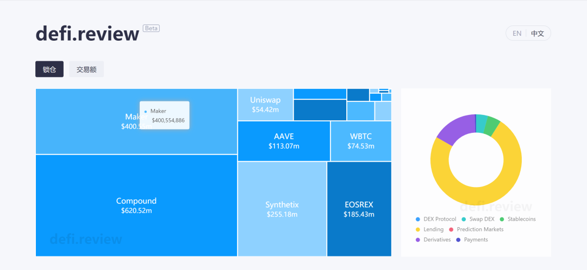
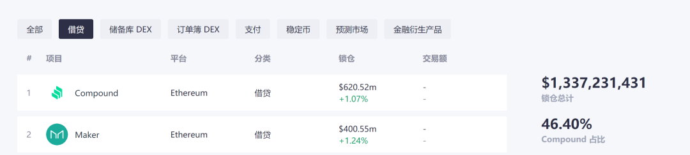
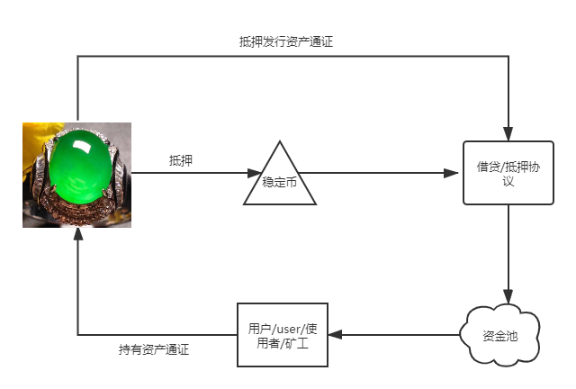

# 案例分析二：玉石资产上链及DeFi玩法

## 背景

近来一段时间DeFi市场大热，相比一年前，DeFi正在逐步扩大自己的发展，随着资产边界的拓展，数字原生资产想象力空间越来越小，由于真实世界资产的体量巨大，由此带来的想象力自然也是不可小觑，所以随着DeFi的日渐发展，对真实资产的需求越来越大，今天我们以玉石资产为例，阐述我们对真实资产上链玩法的理解。

### 目前市场行情和热度

## 目标

1. 基于真实资产，选择合适标的，进行抵押，通过抵押凭证生成稳定币。
2. 基于真实资产，通过审计和抵押，发行数字资产通证，基于通证设计金融衍生品，例如抵押借贷，期权期货等。

> 备注：真实资产抵押流程非常复杂，尤其是需要做好审计和合规，这是整个流程最重要的一环，因受限于篇幅本文不予介绍。

## 解决方案

### 资产通证化

对于玉石来讲，除资产属性外，艺术性较强，传统的途径通过将艺术品份额化，例如文交所成为文化产品实现投资大众化的功能平台，每个投资者都可以持有艺术品产权的一部分，共享收益增值。如此一来，不仅降低了艺术品投资的资金门槛，又减少了鉴定、估值的风险，还使大众投资者能够参与其中。整个逻辑看似巧妙，解决了艺术品的几个痛点，流通难和投资门高等，但实际操作起来，并未解决艺术品的核心痛点-市场小。

因为当一个艺术品份额化到足够分散的时候，已经没有任何一个人真正拥有这幅艺术品了，没有谁能够回购所有份额去兑换这个实物，那么该艺术品的价格仅仅只是电子屏幕上跳跃的数字而已。也就是有价无市，对于艺术爱好者（收藏者）来说，谁会去想拥有几组看不懂的符号而不是真正的艺术品呢？所以对于真实资产，尤其是艺术类资产只是单纯份额通证化是不行的，还需要根据资产类别设计对应的玩法，不能采取简单粗暴的方式按照模板复刻，我们觉得一个可行的方向就是可以根据资产的品类和特性结合DeFi。

需要怎么做呢，首先将真实资产锚定，通过第三方审计机构进行评估，根据评估结果发行对应价值的通证，资产通证代表资产所有权，这样的话资产就成为了底层的抵押品，也就是脱离了艺术属性，变成了一个单纯的资产，这个资产由于比较优质而流动性较好，资产也比较保值，那么就可以根据这个通证设计金融衍生品玩法，底层的根基打好了，那么建立于根基上面的大厦就会稳固。

### 抵押借贷

接下来我们就可以根据抵押通证设计金融衍生品，比如根据最近大热的Compound项目，设计抵押借贷的玩法，我们可以部分借鉴Compound的某些玩法，引入流动性挖矿机制，通过抵押借贷可以：

1. 有效支撑通证的价值体系，增加流动性和使用场景。
2. 增加标的的流动性和价值（流动性溢价）
3. 基于这个基础后续可以很方便的集成其他金融衍生品

由于优质玉石资产相对保值，并且流动性较好，因此，可以选出一种或者几种优质抵押物作为一种稳定币机制。

1. 用户投入超额通证，贷出稳定币，用再贷出的稳定币进行投资。
2. 由于市场不透明，部分玉石资产缺少价格发现机制，因此用户可以用该稳定币购买其他玉石通证，以此获得风险收益。
3. 注意的是，当用户抵押的通证价格下跌时，低于阈值将被清算。

### 设置核心参数

| 名称         | 备注                 |
| ------------ | -------------------- |
| 抵押参数     | 设计抵押率及抵押资产 |
| 清算参数     | 定义清算率           |
| 资金池参数   | 定义储备资金池       |
| 储备因子参数 | 定义储备因子         |
| 汇率         | 定义汇率             |
| 利息         | 定义利息参数         |
| 清算         | 定义清算参数         |
| 关键事件     | 定义关键事件         |

**利息计算**

每个市场的利率都会更新市场中借入资产与供应资产之比发生变化的任何区域。利率的变化取决于为市场实施的利率模型智能合约，以及市场上借入资产与供应资产之比的变化量。

**稳定币参数**

| 名称       | 备注               |
| ---------- | ------------------ |
| 抵押机制   | 定义稳定币抵押机制 |
| 抵押参数   | 超额抵押参数       |
| 清算比例   | 清算               |
| 定义资金池 | 资金池             |

### 业务治理

- 定义投票事项
- 定义投票通过比例
- 定义最小投票率
- 投票有效期
- 定义DAO share流动性激励

总之，在DeFi底层抵押真实资产，然后基于DeFi智能合约免信任机制，设计具有真实使用场景的金融产品，通过去中心化运营和激励的方式，激励玩家参与，创造真正的价值，而不是炒作无意义的符号。

在我看来可能Compound成功只是暂时的，因为没有实际资产支撑做抵押，价值虚高，更多的是用户对于Compound未来的期望，后面的项目如果结合Compound的优秀机制，创新性的以优质实际资产做抵押，那么市值超过Compound只是时间问题。但Compound开了一个好头，让人们知道了DeFi的潜力。

## 最后

目前来说，整个DeFi市场还是属于小众市场，亟待破圈，需要将更多的传统真实资产锚定进来，借鉴现有成熟的传统金融模式可能是更好的方向！